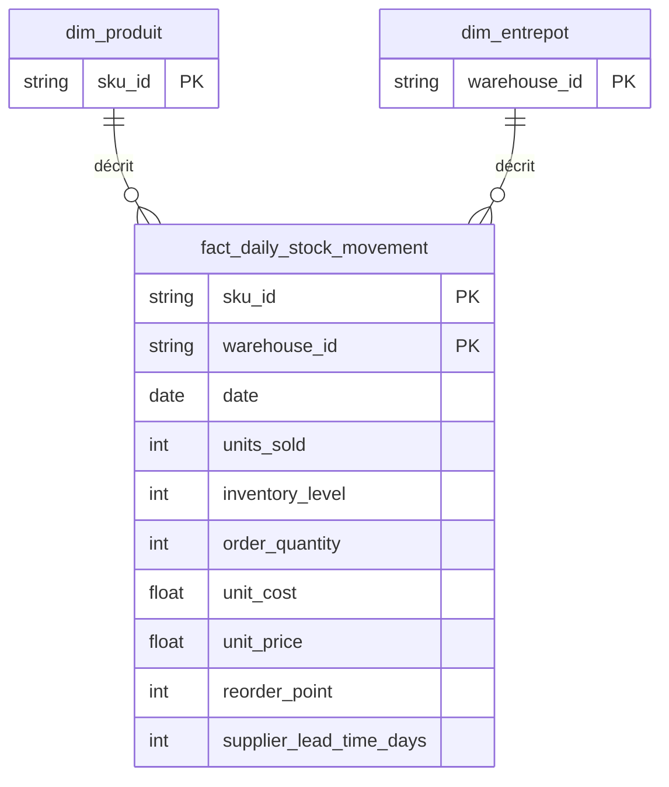
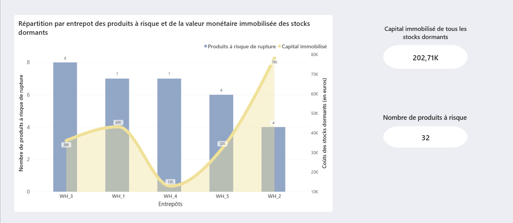

# LogiDistrib: Product Inventory Management

Projet data end-to-end (Python → BigQuery → Power BI) simulant l'analyse de stock d'un distributeur B2B industriel réparti sur 5 entrepôts régionaux.

## 🎯 Contexte & objectif

LogiDistrib fait face à une double inquiétude logistique : de potentielles ruptures de stock, et des produits en surstock qui immobilisent inutilement de la trésorerie.
L'enjeu principal est donc préventif : repérer en amont les produits à risque de rupture à court terme ou dont le seuil de réapprovisionnement est structurellement mal calibré, tout en priorisant le traitement des surstocks selon leur impact financier réel.

## 🗃️ Origine des données

Les analyses reposent sur le dataset public Kaggle [High-Dimensional Supply Chain Inventory Dataset](https://www.kaggle.com/datasets/ziya07/high-dimensional-supply-chain-inventory-dataset). Le scénario LogiDistrib a été construit *a posteriori* pour donner un cadre métier réaliste à ces données.

## 🧭 Axes d'analyse

- **Rupture de stock** — le stock va-t-il tenir ? Constat des ruptures passées, alerte sur les risques présents, diagnostic des seuils mal calibrés.
- **Stock dormant** — le stock est-il resté trop longtemps ? Repérage des surstocks et priorisation selon la valeur financière immobilisée.

*(Détail complet des KPI et de la logique métier : voir [Documentation complémentaire](#-documentation-complémentaire).)*

## 🗂️ Architecture des données

Modèle en **schéma en étoile**, avec une table de faits centrale et deux dimensions.

**`fact_daily_stock_movement`** (table de faits)
Granularité : 1 ligne = 1 SKU × 1 Entrepôt × 1 Jour (50 SKU × 5 entrepôts × 365 jours = 91 250 lignes)
- `sku_id`, `warehouse_id`, `date` — clés de granularité
- `units_sold`, `inventory_level`, `order_quantity` — mouvements de stock
- `unit_cost`, `unit_price` — valorisation financière
- `reorder_point`, `supplier_lead_time_days` — paramètres de réapprovisionnement

**`dim_produit`** — `sku_id` (clé), 50 produits
**`dim_entrepot`** — `warehouse_id` (clé), 5 entrepôts régionaux

> `Stockout_Flag`, présent dans le dataset source, a été exclu du modèle : constant à 0 sur l'ensemble des lignes, sans valeur analytique.

## 🚀 Démarche du projet

1. **Ingestion & modélisation** (`notebooks/`) — exploration et préparation des données en Python/JupyterLab, export `.parquet`, ingestion dans **BigQuery**.
2. **Requêtes analytiques** (`sql/`) — construction des KPI via SQL avancé (CTE, window functions) directement dans **BigQuery**, matérialisés en vues par axe métier (`v_stockout_risk`, `v_dormant_stock`).
3. **Restitution** (`power_bi/`) — dashboard **Power BI** (3 pages) connecté en mode Import, publié sur **Power BI Service**.

## ✅ Résultats clés

- Les ruptures effectivement constatées restent minoritaires (**12,8 % des produits concernés**),confirmant que l'enjeu principal est bien préventif plutôt que curatif.
- **32 produits** identifiés à risque de rupture, pour une **valeur de stock dormant de 202 714,94 €**.
- Répartition des risques par niveau : 18 structurels, 13 immédiats, 1 critique.
- les stocks dormants ne sont pas dans une catégorisation unique (différents entrepôts, différents types de rotation), chacune priorisée en fonction du capital immobilisé

## 🔐 Accès aux environnements cloud (Power BI Service, BigQuery)

Pour simuler un environnement réel de production en entreprise, le dashboard de présentation est en **accès restreint** : une demande via [malicka.houmgbo.data@outlook.com] est nécessaire pour consulter le rapport interactif complet.

Pour BigQuery, l'environnement d'exécution des requêtes n'est pas partagé directement, mais les requêtes SQL sont disponibles dans le dossier `sql/` du dépôt — l'usage de fonctions propres à BigQuery (ex. `SAFE_DIVIDE`, absente de PostgreSQL) atteste qu'elles ont bien été exécutées sur cet environnement.

*Le partage d'accès direct aux environnements cloud (permissions IAM, rôles en lecture seule) sera abordé lors d'un prochain projet, en parallèle de l'introduction de dbt et du versioning avancé.*

## 📚 Documentation complémentaire

- **[Cadrage fonctionnel](docs/cadrage_final_logidistrib.md)** — pour comprendre la logique métier complète : KPI détaillés, règles de segmentation, arbitrages de périmètre.
- **[Journal des Cicatrices](docs/journal_cicatrices.md)** — pas seulement une liste d'erreurs pour faire authentique, mais la preuve que chaque choix technique (modélisation, SQL, visualisation ) a été challengé et compris, pas seulement exécuté.
- **[Charte de transparence IA](docs/charte_transparence_ia.md)** — la posture assumée : l'IA comme outil de vulgarisation et de relecture, jamais comme rédacteur du code.

## Auteur

MalickaHoumgbo / [GitHub](https://github.com/MalickaHoumgbo)
